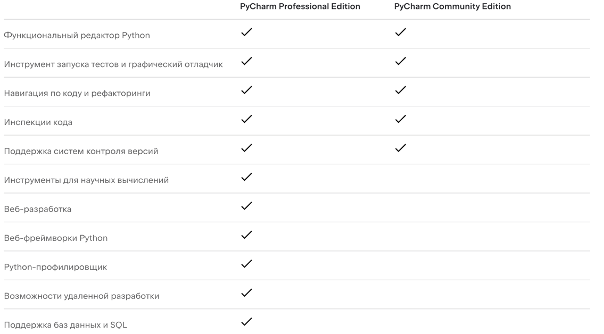

# Вводный семинар

## Организационные моменты
[На главной странице курсы вы можете увидеть всю необходимую информацию.](https://github.com/MikhailMsc/python_for_nlp_stud)

## Работа с кодом

### Python
Если у вас еще не установлен Python, то можно сделать это с официального сайта - https://www.python.org/

### IDE
IDE - интегрированная среда разработки. Это программа/среда, которая делает разработку удобней и проще.   
Это особенно важно когда: 
  - работа идет с большими проектами состоящими из множества папок и файлов;
  - разработка ведется в команде и вы используете Git/GitHub/GitLab.
  
Основные функции и фичи:
  - интеллектуальный редактор кода - подсвечивает ошибки, выделение синтаксиса, интеллектуальное завершение кода
  - компиляция и запуск программ
  - тестирование и отладка
  - интеграция с система версионного контроля (git) 

Для Python я советую [Pycharm](https://www.jetbrains.com/ru-ru/pycharm/). Есть две версии - Professional и Community, первая платная (но не для студентов и преподавателей!), вторая бесплатная.   
На картинке вы увидите разницу между Professional и Community.

Скачайваете с официального сайта и устанавливаете необходимую версию для своей ОС.  
Если хотите Professional, то [регистрируетесь на сайте](https://www.jetbrains.com/shop/eform/students) и получаете студенческую лицензию.

### Редакторы кода
Иногда не хочется открывать весь проект Pycharm-ом, а хочется быстро открыть отдельный  python-файл. Для этого существует множетсво редакторов кода с подсветкой систанксиса и другими фичами для удобства просмотра/редактирования:
- VS Code
- Notepad++
- Sublime

Выбираете любой какой понравился и подошел для вашей ОС.

### Jupyter/JupyterLab
Jupyter/JupyterLab - это удобная интерактивная среда для работы с данными и их исследования. Работает через браузер.
Устанавливется с помощью менеждера пакетов pip:
> pip install jupyterlab

Советы по Jupyter:  
- так как Jupyter не так активно следит за стилистикой кода (в отличие от Pycharm-а), лучше доустановить некоторые пакеты:
    > pip install pycodestyle flake8 pycodestyle_magic  

  В начале ноутбука запускаем в ячейке следующий код, это поможет соблюдать чистоту дальнейшего кода:
    > %load_ext pycodestyle_magic  
      %pycodestyle_on 
  
- в Jupyter есть разные "магические" команды, которые могу быть полезны.
  - %lsmagic - выведет список всех магических команд
  - %time - время исполнения текущей ячейки
  - %timeit - среднее время исполнения текущей ячейки за несколько запусков
  - %load_ext - загрузка расширения  
  
- Jupyter поддерживает LaTex (язык для написания математических выражений), Markdown (упрощенный язык разметки) и HTML (язык разметки). Используйте их для большей наглядности ваших ноутбуков.
    - [Синтаксис по Markdown](https://www.markdownguide.org/basic-syntax/)
    - [Синтаксис по LaTex](https://ru.overleaf.com/learn)
    - [Пример alert-box-ов для выделения комментариев цветом](https://getbootstrap.com/docs/4.0/components/alerts/)

### Версионный контроль 
