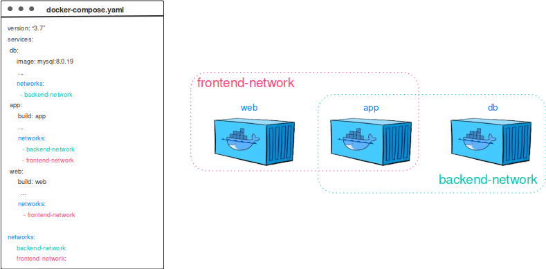

# Продвинутая практика
## docker-compose/docker compose
Как `docker` может управлять отдельно взятым контейнером, так `docker-compose` помогает управлять не просто одним, а всеми контейнерами, которые составляют распределенное приложение. Причём, не только контейнерами, но и сетями, подключенными директориями и всеми связанными с этим настройками.

Есть 2 версии `docker-compose`, версия v1 написанная на python и устанавливается отдельно от `docker`. Версия v2 написана над Golang как и `docker` и распространяется вместе с новыми версиями `docker`.
Пример вызова отдельно установленного `docker-compose` v1:
```bash
docker-compose --version
# docker-compose version 1.29.2, build 5becea4c

```
Пример вызова `docker-compose` v2, распространяемого вместе с новыми версиями `docker`:
```bash
docker --version
# Docker version 20.10.9, build c2ea9bc90b

docker compose --help
# Docker Compose

# Options:
#       --ansi string                Control when to print ANSI control characters ("never"|"always"|"auto") (default "auto")
#       --compatibility              Run compose in backward compatibility mode
#       --env-file string            Specify an alternate environment file.
#   -f, --file stringArray           Compose configuration files
#       --profile stringArray        Specify a profile to enable
#       --project-directory string   Specify an alternate working directory
#                                    (default: the path of the Compose file)
#   -p, --project-name string        Project name

# Commands:
#   build       Build or rebuild services
#   convert     Converts the compose file to platform's canonical format
#   cp          Copy files/folders between a service container and the local filesystem
#   create      Creates containers for a service.
#   down        Stop and remove containers, networks
#   events      Receive real time events from containers.
#   exec        Execute a command in a running container.
#   images      List images used by the created containers
#   kill        Force stop service containers.
#   logs        View output from containers
#   ls          List running compose projects
#   pause       pause services
#   port        Print the public port for a port binding.
#   ps          List containers
#   pull        Pull service images
#   push        Push service images
#   restart     Restart containers
#   rm          Removes stopped service containers
#   run         Run a one-off command on a service.
#   start       Start services
#   stop        Stop services
#   top         Display the running processes
#   unpause     unpause services
#   up          Create and start containers

# .

```
## Многосервисный проект на docker compose
Подробнее о проекте можно посмотреть [здесь](https://www.docker.com/blog/containerized-python-development-part-2/).
Проект будет состоять из 3-х сервисов показанных ниже:

### Описание проекта с использованием docker compose
Файлы в директории проекта:
```
Project
├─── docker-compose.yml
├─── web
├─── app
│ ├─── Dockerfile
│ ├─── requirements.txt
│ └─── src
│ └─── server.py
└─── db
```
То, как `docker-compose` будет конфигурировать сервисы в описывается файлом `docker-compose.yaml`/`docker-compose.yml`.
Рассмотрим `docker-compose.yml` этого проекта:

```yml
version: "3.7" # версия описания d-c , см другие версии https://docs.docker.com/compose/compose-file/
# ключ, который содержит все сервисы, которые будут разворачиваться
services:
  db:
    # базовый образ из docker hub
    image: mysql:8.0.19
    # команда, которая отработает после разворачивании контейнера
    command: '--default-authentication-plugin=mysql_native_password' 
    # если контейнер завершиться с ошибкой, тогда необходимо будет переподнять его
    restart: always
    # переменные среды, которые будут переданы в контейнер
    environment:
      - MYSQL_DATABASE=example
      - MYSQL_ROOT_PASSWORD=password

  app:
    # образ, из которого будет создаваться контейнер будет собираться на основе Dockerfile из директории ./app
    build: app
    restart: always

  web:
    build: web
    restart: always
    # Порты, которые будут отображать из контейнера на хостовую машину.
    ports:
      - 80:80
```
### Разделение проекта на разные сети
В нашем предыдущем варианте проект находится в одной сети (network) контейнеров:


Можно разделить видимости сети в зависимости от сервисов:

